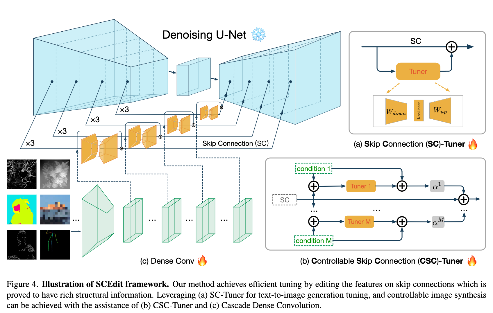

# SCEdit-pytorch
<a href="https://colab.research.google.com/github/mkshing/scedit-pytorch/blob/main/scripts/scedit_pytorch.ipynb" target="_parent"></a>


This is an implementation of [SCEdit: Efficient and Controllable Image Diffusion Generation via Skip Connection Editing](https://scedit.github.io/) by [mkshing](https://twitter.com/mk1stats).


* Beyond the paper, this implementation can use SDXL as the pre-trained model.
* Enabled to set the weight scale by `scale`.
* As the paper says, the architecture of SCEdit is very flexible. `SCTunerLinearLayer` I implemented seems too small compared to what the paper mentioned. So, please let me know if you find better ones. 



## Installation

```bash
git clone https://github.com/mkshing/scedit-pytorch.git
cd scedit-pytorch
pip install -r requirements.txt
```

## SC-Tuner

### Training
The training script is pretty much same as the [lora's script from diffuers](https://github.com/huggingface/diffusers/blob/main/examples/dreambooth/README_sdxl.md).


```bash
MODEL_NAME="stabilityai/stable-diffusion-xl-base-1.0"
INSTANCE_DIR="path-to-dataset"
OUTPUT_DIR="scedit-trained-xl"

accelerate launch train_dreambooth_scedit_sdxl.py \
  --pretrained_model_name_or_path=$MODEL_NAME  \
  --instance_data_dir=$INSTANCE_DIR \
  --output_dir=$OUTPUT_DIR \
  --mixed_precision="fp16" \
  --instance_prompt="a photo of sbu dog" \
  --resolution=1024 \
  --train_batch_size=1 \
  --gradient_accumulation_steps=8 \
  --learning_rate=5e-5 \
  --lr_scheduler="constant" \
  --lr_warmup_steps=0 \
  --max_train_steps=1000 \
  --checkpointing_steps=200 \
  --validation_prompt="A photo of sbu dog in a bucket" \
  --validation_epochs=100 \
  --use_8bit_adam \
  --report_to="wandb" \
  --seed="0" \
  --push_to_hub

```

### Inference

#### Python example:
```python
from diffusers import DiffusionPipeline
import torch
from scedit_pytorch import UNet2DConditionModel, load_scedit_into_unet


base_model_id = "stabilityai/stable-diffusion-xl-base-1.0"
scedit_model_id = "path-to-scedit"

# load unet with sctuner
unet = UNet2DConditionModel.from_pretrained(base_model_id, subfolder="unet")
unet.set_sctuner(scale=1.0)
unet = load_scedit_into_unet(scedit_model_id, unet)
# load pipeline
pipe = DiffusionPipeline.from_pretrained(base_model_id, unet=unet)
pipe = pipe.to(device="cuda", dtype=torch.float16)
```

#### Gradio Demo:
```bash
MODEL_NAME="stabilityai/stable-diffusion-xl-base-1.0"
SCEDIT_NAME="mkshing/scedit-trained-xl"

python scripts/gradio.py \
  --pretrained_model_name_or_path $MODEL_NAME \
  --scedit_name_or_path $SCEDIT_NAME
```

## TODO
- [x] SC-Tuner
- [ ] CSC-Tuner